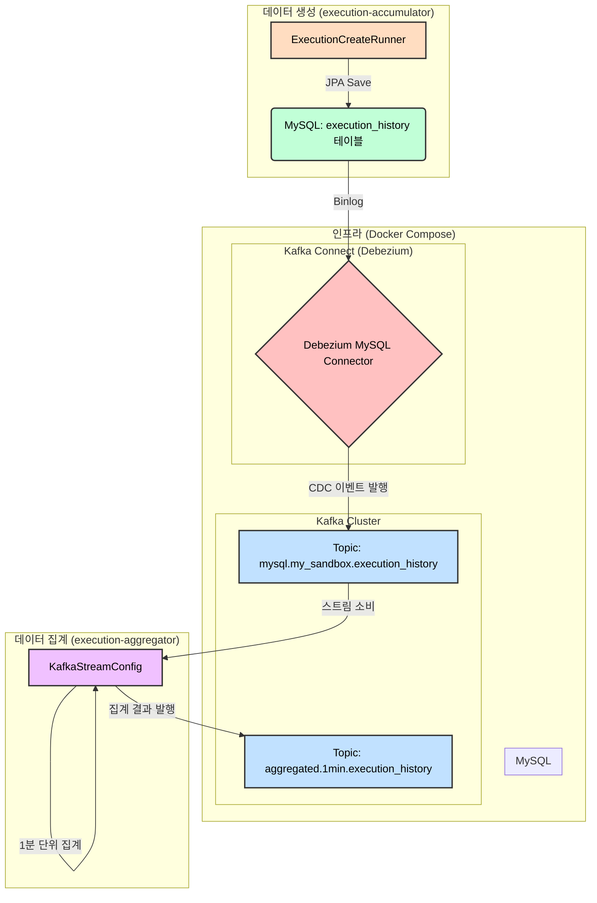

# CDC (Change Data Capture) 프로젝트

## 1. 프로젝트 개요

이 프로젝트는 **CDC (Change Data Capture)** 패턴을 구현한 예제입니다. 데이터베이스(MySQL)에서 발생하는 변경 사항을 실시간으로 감지하여 Kafka로 스트리밍하고, Kafka Streams를 사용해 데이터를 집계하는 구조로 되어 있습니다.

주요 구성 요소는 다음과 같습니다.

*   **`datasource`**: Docker Compose를 사용하여 전체 인프라(MySQL, Kafka, Zookeeper, Debezium)를 관리합니다.
*   **`execution-accumulator`**: MySQL 데이터베이스에 대량의 데이터를 지속적으로 생성하고 저장하는 Spring Boot 애플리케이션입니다. 데이터 변경 이벤트를 발생시키는 역할을 합니다.
*   **`execution-aggregator`**: Kafka Streams를 사용하여 `execution-accumulator`가 발생시킨 변경 데이터를 실시간으로 집계하는 Spring Boot 애플리케이션입니다.

---

## 2. 아키텍처 다이어그램

---

## 3. 데이터 흐름

1.  **데이터 생성 (`execution-accumulator`)**
    *   `ExecutionCreateRunner`가 실행되면 `execution_history` 테이블에 대량의 체결 내역 데이터를 지속적으로 삽입합니다.
    *   이 과정에서 MySQL의 바이너리 로그(Binlog)에 변경 기록이 남게 됩니다.

2.  **변경 데이터 캡처 (Debezium & Kafka Connect)**
    *   `kafka-connect` 서비스는 Debezium의 MySQL 커넥터를 사용하여 MySQL 서버의 바이너리 로그를 읽고 `execution_history` 테이블의 변경 사항을 실시간으로 감지합니다.
    *   감지된 변경 사항은 JSON 메시지로 변환되어 Kafka의 `mysql.my_sandbox.execution_history` 토픽으로 전송됩니다.

3.  **데이터 집계 (`execution-aggregator`)**
    *   `execution-aggregator` 애플리케이션은 Kafka Streams API를 사용하여 `mysql.my_sandbox.execution_history` 토픽을 구독합니다.
    *   스트리밍된 데이터를 `userId`와 `symbol` 기준으로 그룹화하고, 1분 단위의 텀블링 윈도우를 적용하여 `amount`를 합산합니다.
    *   최종 집계된 결과는 `aggregated.1min.execution_history`라는 새로운 Kafka 토픽으로 발행됩니다.

---

## 4. Q&A

### Q. 1분 단위로 집계할 때 집계 기준 시각도 남기고 있나요?

**A.** 네, 집계 기준 시각도 함께 기록되고 있습니다.

`execution-aggregator`는 1분 단위로 데이터를 집계한 후, Kafka 토픽에 저장할 때 **집계 윈도우(Window)의 시작 시각과 종료 시각**을 메시지 **Key**에 포함하여 기록합니다.

최종적으로 생성되는 메시지의 Key 형식은 다음과 같습니다.

`{userId}_{symbol}_{window_start_timestamp}_{window_end_timestamp}`

이를 통해 어떤 시간대의 집계 결과인지 명확하게 알 수 있습니다.
